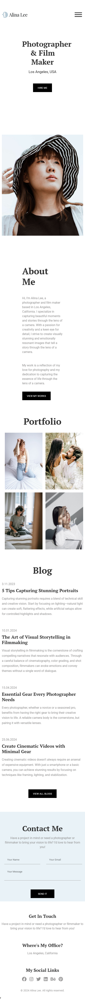

# Photographer Portfolio Website

Welcome to my Photographer Portfolio website! This site showcases a collection of my best photography work. It is designed to be clean, modern, and easy to navigate, offering visitors a seamless experience to explore my photography services and gallery.

## Live Preview

You can view the live website at the following link:  
[Live Preview](https://friendly-semifreddo-449bf2.netlify.app)

## Features

- **Responsive Design**: The site is responsive and adapts to various screen sizes, providing an optimal viewing experience on mobile devices and desktops.
- **Image Gallery**: A collection of high-quality images showcasing my photography work.
- **Contact Form**: An easy-to-use form for clients to get in touch with me for inquiries or bookings.
- **Smooth Navigation**: Simple and intuitive navigation, making it easy to explore different sections of the site.
- **Animations and Effects**: Subtle animations to enhance the user experience.

## Technologies Used

- **HTML**: For the website structure.
- **CSS**: For styling the website and making it responsive.
- **JavaScript**: For added interactivity and functionality, such as the image gallery lightbox and smooth scrolling.

## Screenshots

Here are some screenshots of the website:

